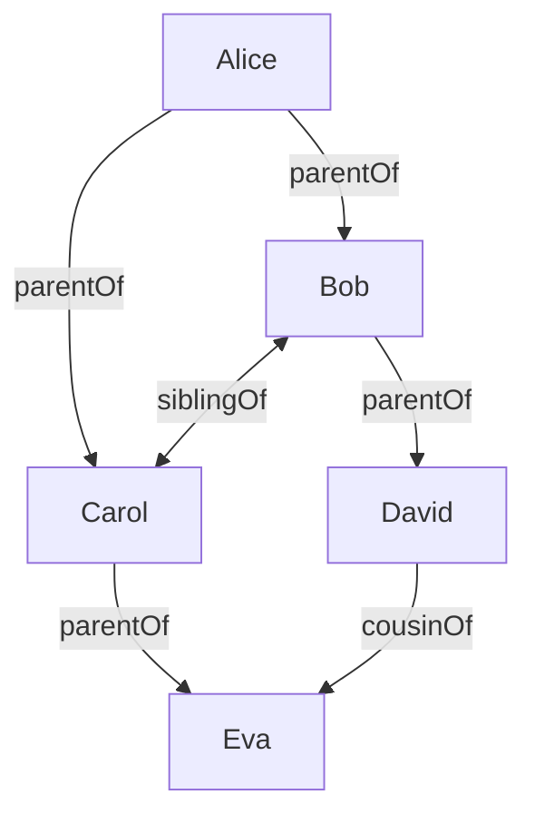

# Family Relationship Inference

This directory contains SPARQL INSERT queries that materialize family relationships. While these relationships could be inferred through OWL rules, some triplestores may not support all inference types. These queries ensure consistent relationship representation across different triplestore implementations.

## Core Relationships

Our base relationships come from standard vocabularies:
- `rel:parentOf` from relationship vocabulary
- `foaf:Person` from FOAF vocabulary

## Inferred Relationships

The inference rules handle:

1. **Direct Inference**
   - `siblingOf`: Derived from shared parents
   - `grandparentOf`: Derived from parent chains

2. **Complex Inference**
   - `uncleAuntOf` / `niblingOf`: Derived from parent's siblings (bidirectional)
   - `cousinOf`: Derived from parent's siblings' children

## Example Inference Chain



This diagram shows how basic `parentOf` relationships lead to inferred `siblingOf` and `cousinOf` relationships.

## Query Order

The queries must be run in the following order due to dependencies:

1. `materializeInference-siblingOf.sparql`
   - **Input**: `rel:parentOf` relationships
   - **Output**: Symmetric `rel:siblingOf` relationships
   - **Description**: Infers sibling relationships from shared parents

2. `materializeInference-uncleAuntOf-niblingOf.sparql`
   - **Input**: `rel:siblingOf`, `rel:parentOf`
   - **Output**: `rel:uncleAuntOf` and `rel:niblingOf` relationships (bidirectional)
   - **Description**: Identifies aunts/uncles as siblings of parents, and niblings as their inverse

4. `materializeInference-cousinOf.sparql`
   - **Input**: `rel:siblingOf`, `rel:parentOf`
   - **Output**: Symmetric `rel:cousinOf` relationships
   - **Description**: Connects children of siblings as cousins

Each query builds on previously inferred relationships, so the execution order is critical.

## Running the Inference

Use the `run_inference.py` script in the parent directory to run all inference queries in the correct order:

```bash
python run_inference.py
```

## Query Design Notes

- All queries use `rel:parentOf` as the base relationship (not `rel:childOf`) for consistency
- Sibling relationships are explicitly inserted in both directions to ensure symmetry
- Self-relationships are prevented using FILTER clauses
